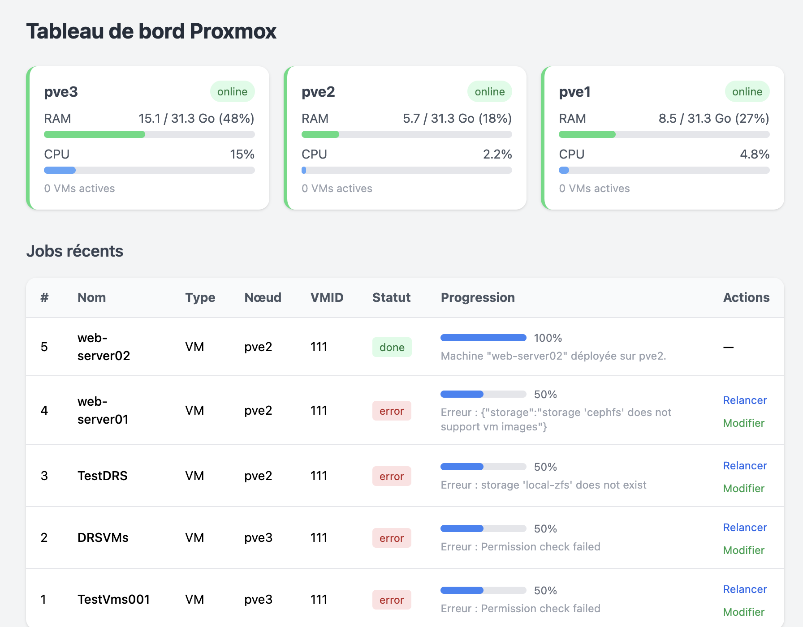
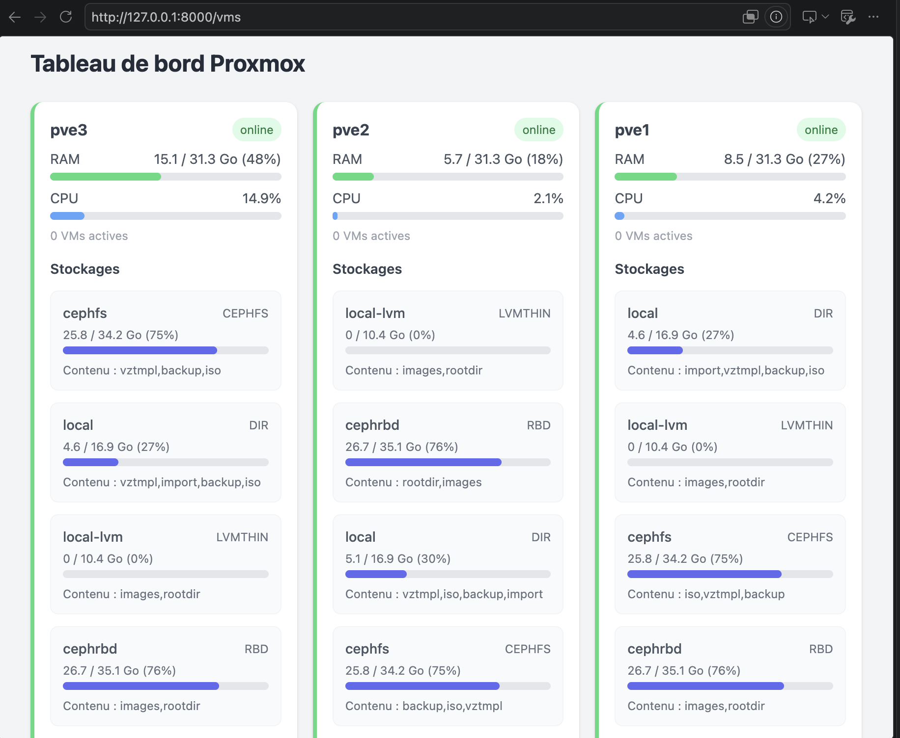
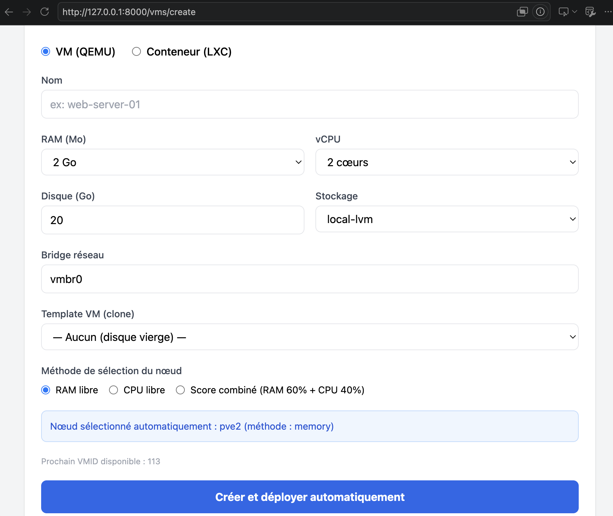
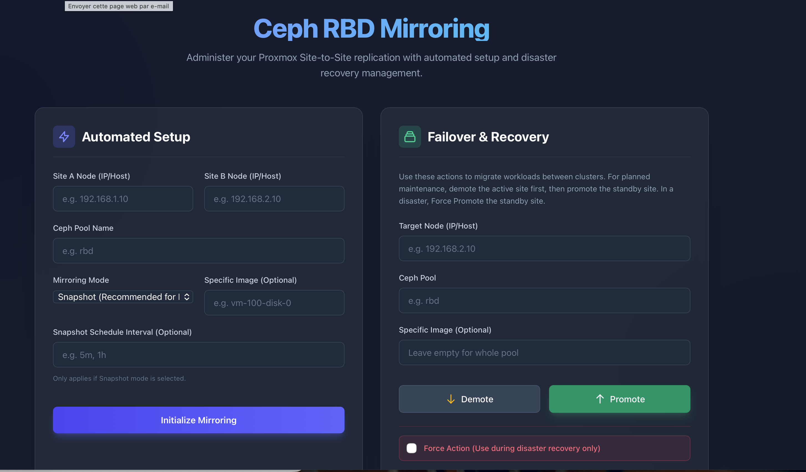

# DRS — Dynamic Resource Scheduler & Site-to-Site Replication
secret : *****-&&&&-@@@@@-&&&&&&-$$$$$$$ / Token ID : xxxx@####!drs
Application Laravel pour déployer des VMs et conteneurs LXC sur un cluster Proxmox avec sélection automatique du nœud optimal.

## Site-to-Site Ceph Replication (RBD Mirroring)

This repository also contains administration scripts for managing site-to-site replication using Ceph RBD Mirroring in a Proxmox VE environment.

### Features

- **Automated Setup:** Handles user creation, keyring transfers, and configuring the `rbd-mirror` daemon.
- **Failover & Recovery:** Provides tools to promote/demote images during disaster recovery or planned maintenance.

### Scripts

#### 1. setup_rbd_mirror.sh

Sets up mirroring from a source site (Site A) to a target site (Site B).

**Usage:**
```bash
./setup_rbd_mirror.sh --site-a-node <IP_OR_HOST_A> --site-b-node <IP_OR_HOST_B> --pool <POOL_NAME>
```

**Optional Arguments:**
- `--mode <snapshot|journal>`: Choose mirror mode (default: `snapshot`). Note: `journal` is NOT supported for KRBD images or LXC containers.
- `--image <IMAGE_NAME>`: Specifically enable mirror on a single image.
- `--schedule <INTERVAL>`: E.g., `5m` or `1h` (only applicable in `snapshot` mode).

---

#### 2. failover_recovery.sh

Used for planned failovers or disaster recovery when switching active sites.

**Planned Switch (Site A to Site B):**
1. Demote on Site A: `./failover_recovery.sh --node <SITE_A> --action demote --pool <POOL_NAME>`
2. Promote on Site B: `./failover_recovery.sh --node <SITE_B> --action promote --pool <POOL_NAME>`

**Disaster Recovery (Site A goes down):**
1. Force Promote on Site B: `./failover_recovery.sh --node <SITE_B> --action promote --pool <POOL_NAME> --force`

**Important:** Make sure to sync your VM/LXC configuration files (from `/etc/pve/qemu-server` and `/etc/pve/lxc`) to the recovery site independently, e.g., using `rsync`.

## Architecture

```
Laravel App
    ├── ProxmoxService       ← appels API REST Proxmox
    ├── NodeSelectorService  ← logique de choix du meilleur nœud
    ├── VmController         ← endpoints HTTP (web + API)
    ├── CreateProxmoxVm      ← job asynchrone de création
    └── Blade UI             ← formulaire de création + tableau de bord
```
Dashboard :

Add storage section :

Create VMs/CTs

Ceph Mirroring RBD 


## Prérequis

- PHP 8.2+
- Composer
- Extension SQLite (ou MySQL/PostgreSQL)

## Installation

```bash
composer install
cp .env.example .env
php artisan key:generate
```

Configurer Proxmox dans `.env` :

```env
PROXMOX_HOST=votre-serveur.proxmox
PROXMOX_PORT=8006
PROXMOX_USER=root@pam
PROXMOX_TOKEN_ID=votre-token
PROXMOX_TOKEN_SECRET=votre-secret
PROXMOX_VERIFY_SSL=false
```

Puis :

```bash
php artisan migrate
php artisan db:seed
```

## Démarrage

Terminal 1 — serveur web :

```bash
php artisan serve
```

Terminal 2 — worker de queue (création asynchrone) :

```bash
php artisan queue:work
```

Interface web : http://localhost:8000/vms

## API (Sanctum)

Compte par défaut après seed : `admin@drs.local` / `password`

```bash
# Login
curl -X POST http://localhost:8000/api/login \
  -H "Content-Type: application/json" \
  -d '{"email":"admin@drs.local","password":"password"}'

# Créer une VM (token Bearer)
curl -X POST http://localhost:8000/api/vms \
  -H "Authorization: Bearer TOKEN" \
  -H "Content-Type: application/json" \
  -d '{
    "name": "web-01",
    "type": "vm",
    "memory": 2048,
    "cores": 2,
    "disk_size": 20,
    "storage": "local-zfs",
    "bridge": "vmbr0",
    "method": "score"
  }'

# Suivi du job
curl http://localhost:8000/api/jobs/1 \
  -H "Authorization: Bearer TOKEN"
```

## Endpoints

| Méthode | Route | Description |
|---------|-------|-------------|
| GET | `/vms` | Tableau de bord |
| GET | `/vms/create` | Formulaire de création |
| POST | `/vms` | Lancer un déploiement |
| GET | `/api/nodes` | Statut des nœuds (public web) |
| GET | `/api/best-node` | Meilleur nœud selon méthode |
| GET | `/api/templates` | Templates VM/CT disponibles |
| POST | `/api/login` | Authentification Sanctum |
| POST | `/api/vms` | Création via API (auth) |
| GET | `/api/jobs/{id}` | Statut d'un job |

## Méthodes de placement

- **memory** — nœud avec le plus de RAM libre
- **cpu** — nœud avec la charge CPU la plus faible
- **score** — score combiné RAM (60%) + CPU (40%)
